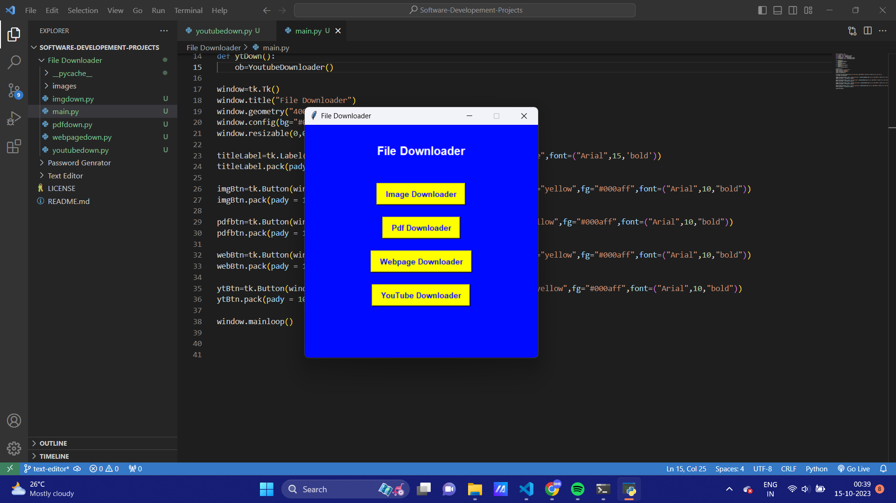
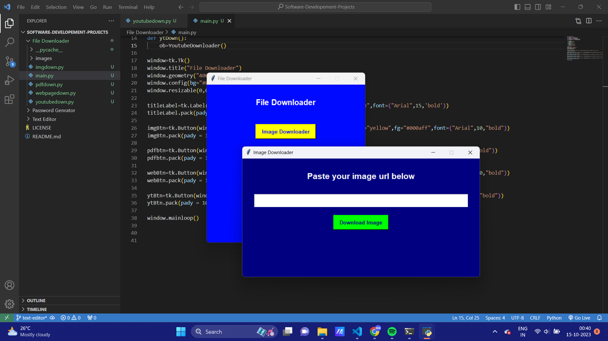
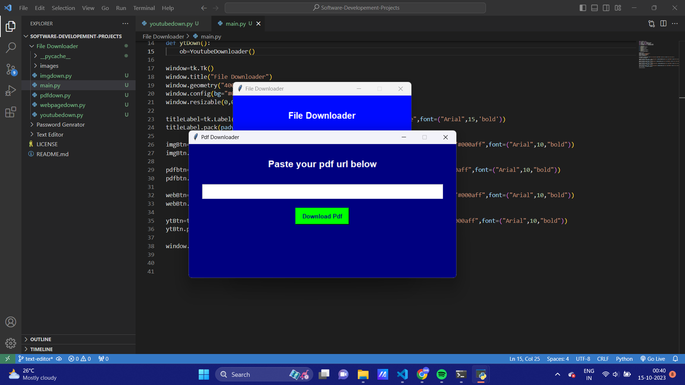
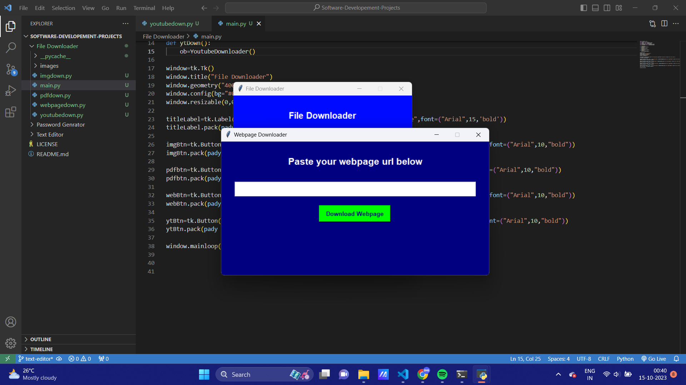
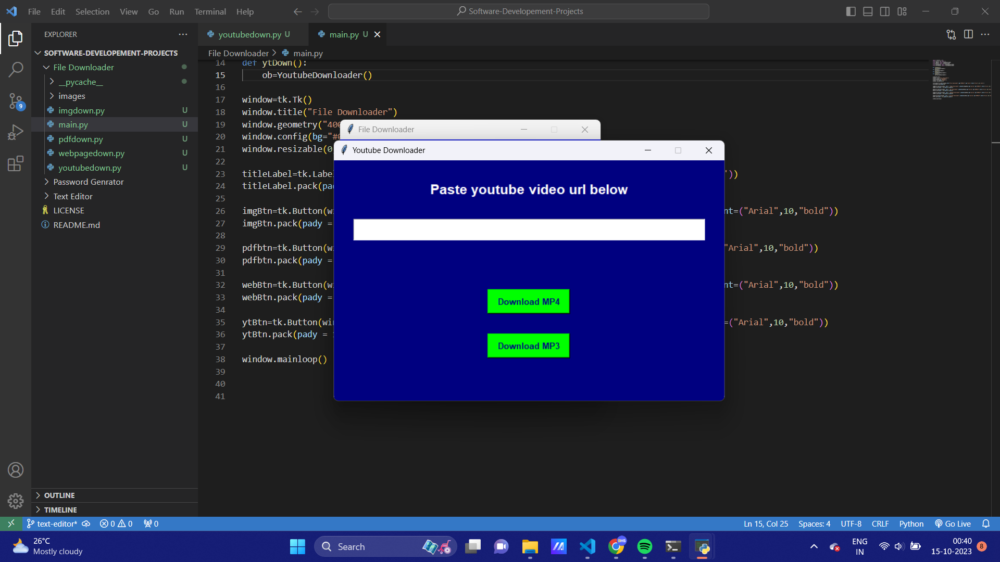

# File Downloader

File downloader is a tool that allows the user's download the files from the internet.User can provide a URL and the application will download and save the file locally.

## Table of Contents
- [Demo](#demo)
- [Features](#features)
- [Getting Started](#getting-started)
- [Usage](#usage)

---


## Demo







## Features

- It allows the users to download image files 
- It allows the users to download pdf files 
- It allows the users to download webpage from the internet
- It allows the users to download audio and video from the youtube

## Getting Started

### Prerequisites

- Python Environment
- `pip install pillow` 
- `pip install pytube`

### Installation

1. Clone the repository or download the ZIP file.

```bash
git clone https://github.com/Prodigy-InfoTech/Software-Development-Projects.git
```

2. Open the project folder.

```bash
cd File Downloader
```

3. Run `main.py` file on your local machine.

## Usage

1. Open the `main.py` file.
2. Select your file preference 
3. Enter the file url
4. Click donwload button and Enjoy it.
---

## Developed By
Balaharisankar L :  https://github.com/BHS-Harish