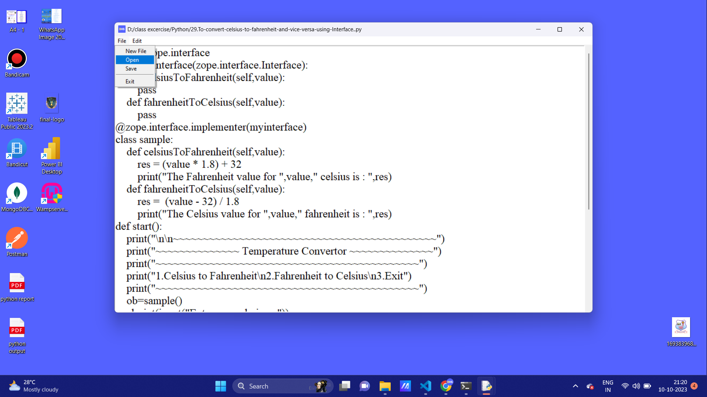

# Text Editor

Text editor application was created using python programming language. It allows users to create, open, edit and save files.

## Table of Contents
- [Demo](#demo)
- [Features](#features)
- [Getting Started](#getting-started)
- [Usage](#usage)

---

## Demo



## Features

- Users can easily create their text files and save their files in what ever extension they want.
- It allows the users to open and edit their files.
- It have options like cut, copy and paste.
- Multiple windows are allowed

## Getting Started

### Prerequisites

- Python Environment

### Installation

1. Clone the repository or download the ZIP file.

```bash
git clone https://github.com/Prodigy-InfoTech/Software-Development-Projects.git
```

2. Open the project folder.

```bash
cd Text Editor
```

3. Run `main.py` in your preferred web browser.

## Usage

1. Open the `main.py` file.
2. Type your content and save your file.
3. Open your files and edit and save.
4. Work on multiple window .
---

## Developed By
Balaharisankar L :  https://github.com/BHS-Harish